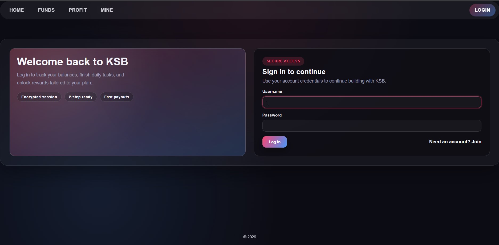
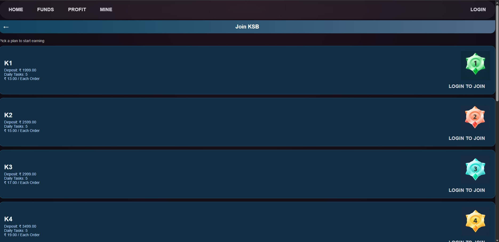
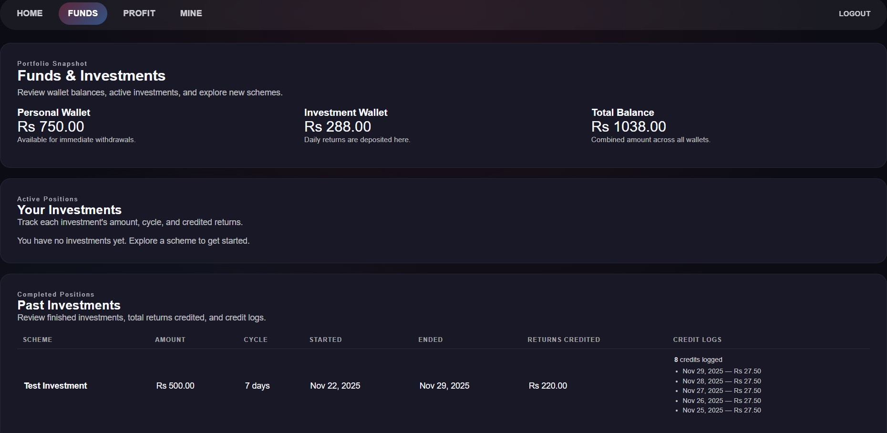
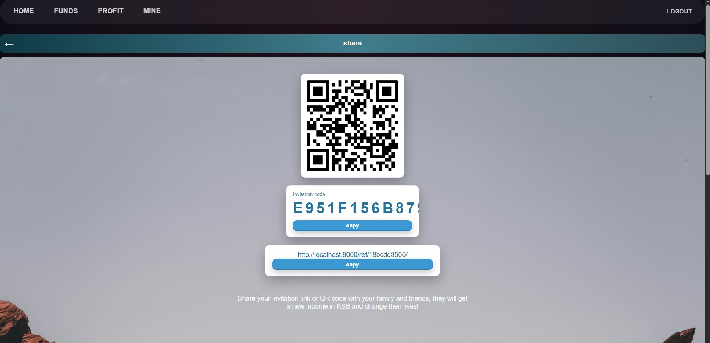
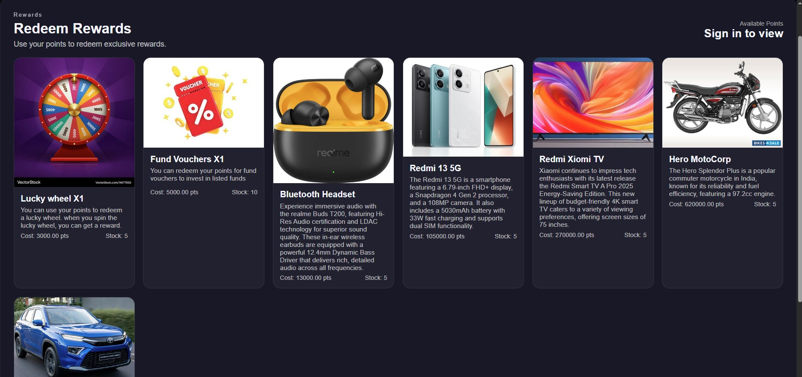
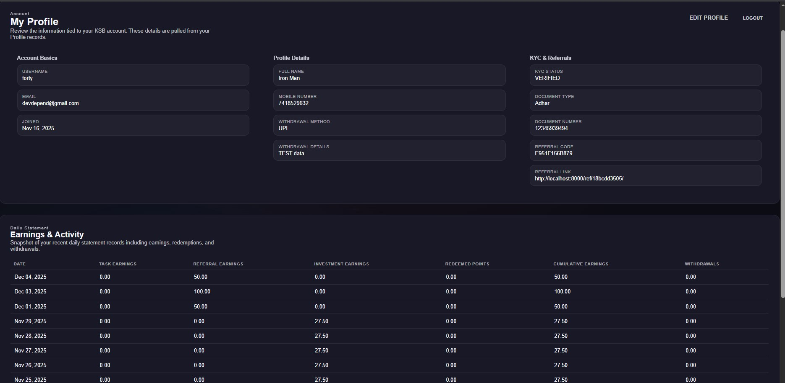

# Django Finance managment app

A Django-based web application for managing investments, referrals, rewards, wallets, payments, and user plans.

This repository demonstrates a full-stack finance-focused platform built with Python and Django, including user authentication, referral tracking, investment management, reward flows, and administrative dashboards.

## Key Features

- User signup, login, and profile management
- Investment plan creation and tracking
- Referral system with rewards and commissions
- Wallet and payment management
- Admin and dashboard pages for system oversight
- Modular Django apps for clean architecture

## Project Structure

- `core/` - shared application logic and utilities
- `investments/` - investment plans, transactions, and services
- `referrals/` - referral tracking and reward calculations
- `wallets/` - wallet balances and payment interactions
- `payments/` - payment processing and integration
- `plans/` - subscription and investment plan management
- `users/` - authentication, profiles, and user-specific views

## Demo Screenshots

Below are sample pages from the app UI. Images are shown as smaller thumbnails for easy preview.

  
  
  

  
  
  

  

## Getting Started

1. Create a Python virtual environment and activate it.
2. Install dependencies from `requirements.txt`.
3. Run `python manage.py migrate` to apply database migrations.
4. Run `python manage.py runserver` to start the development server.
